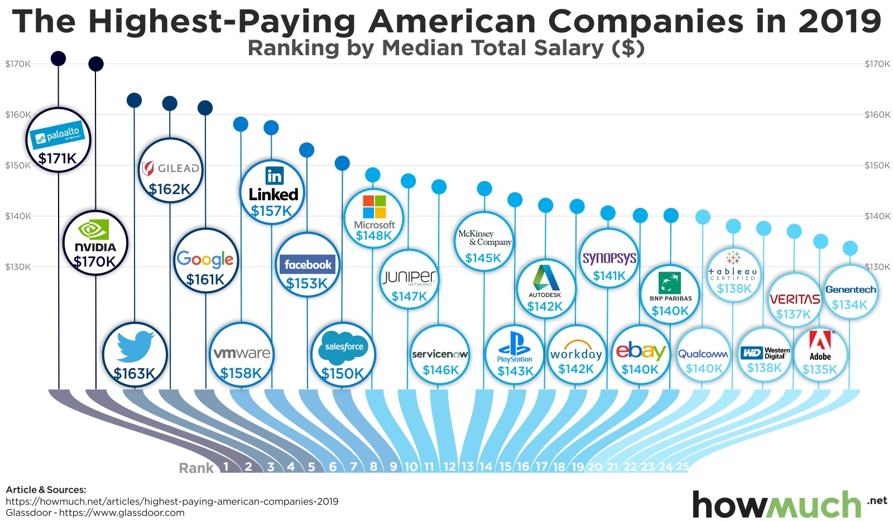

```{r setup, include=FALSE}
# Do not change these settings!
knitr::opts_chunk$set(warning = FALSE, message = FALSE)
```

###  {.tabset}

Click the **Original**, **Code** and **Reconstruction** tabs to read about the issues and how they were fixed.

#### Original

<br>

<center></center>

<center>*Source:* Martinčević 2019</center>

<br>

**Objective:**

This visualisation shows the highest paying American companies in 2019. The main objective of this data visualisation is to observe and compare the highest-paying American companies by the median total salary (\$USD) in the year 2019. Furthermore, this visualisation aims to provide the target audience with company insights of different pay scale in different companies and to help them make an informed decision when making their next career move.

**Target Audience:**

This data visualisation was based on a data source from Glassdoor, a website which is currently a leader in producing jobs and company insights (Glassdoor 2023). From this data source, we can confidently identify that the target audience for this visualisation are job seekers, employees and employers looking for insights of the highest paying companies in America.

**Three main issues of this Visualisation:**

-   **Junk Charts Trifecta Checkup**
    -   Based on the framework Junk Charts Trifecta Checkup, which consists of Q - question, D - data, and V - visuals, this data visualisation has failed this checkup due to the V (Fung 2014). From the first bat, we can see that this visualisation looks very busy, and it takes some time to decode this visualisation to understand what the question and data is about. One of the main reasons why this visualisation looks busy is due to the images in the visualisation. One way to address this issue is by removing the images from this visualisation and use a simple bar chart for easier understanding of the data.
-   **Data Integrity**:
    -   Looking at the bottom left of the data visualisation which provides the source of the data, it only shows the secondary source of the data and not the primary source of data, which was obtained from glassdoor website. Although they included Glassdoor, they did not include the primary website source of the data. This issue can be improved by including the primary source of data.
-   **Deception:**
    -   Deception in a data visualisation could be seen as intentionally or unintentionally, regardless of the intention, deception can deceive audiences of the question and answers to a data visualization (Bresciani and Eppler 2008). From this data visualisation we can see that due to the bubbles with the company logo being in different places, the reader can mistake these bubbles as the ranking of the median salary. This issue can be improved by relocating the image bubbles, or to completely remove the image bubbles.

**Reference**

-   Bresciani S and Eppler MJ (2008) 'The Risks of Visualization', *Institute for Corporate Communication*. accessed 20 April 2023. <https://www.knowledge-communication.org/pdf/bresciani-eppler-risks-visualization-wpaper-08.pdf>

-   Fung K (2014) *Junk Charts Trifecta Checkup: The Definitive Guide*, Junk Charts website, accessed 20 April 2023. <https://junkcharts.typepad.com/junk_charts/junk-charts-trifecta-checkup-the-definitive-guide.html>

-   Glassdoor (2023) *About Us/Press*, Glassdoor website, accessed 20 April 2023. <https://www.glassdoor.com/about/>

-   Martinčević I (2019) *Charted: The Highest-Paying Companies in the U.S.*, HowMuch.net website, accessed 20 April 2023. <https://howmuch.net/articles/highest-paying-american-companies-2019>

#### Code

The following code was used to fix the issues identified in the original.

```{r}
library(ggplot2)
library(readr)
library(dplyr)
library(stringr)

company<-read_csv("Highest Paying Companies in the US 2019.csv")

head(company)
str(company)

colnames(company)<-c("Rank","Name","Median")

company <- mutate(company, Values = ifelse(Median>=170000,T,F))

graph<-ggplot(data=company, aes(x=reorder(Name,Median),y=Median/1000,fill=Values)) + geom_bar(stat="identity") + scale_y_continuous(limits=c(0,200),breaks=c(0,15,30,45,60,75,90,105,120,135,150,165,180)) + coord_flip() + theme_minimal() + theme(legend.position = "right", plot.title=element_text(hjust=0),plot.caption=element_text(hjust=0),axis.title.y=element_text(vjust =3),axis.title.x=element_text(vjust=0)) + scale_fill_manual(values=c("TRUE"="chocolate","FALSE"="darkseagreen4"), labels=c("<$170,000",">$170,000")) + labs(title= str_wrap("Highest Paying Companies in the U.S. by Median Total Salary (2019)",60),x="Company Name",y="Median Total Salary in USD ('000)",caption="Source: https://www.glassdoor.com/research/jobs-companies-2019/") + geom_text(size=2.5,aes(label=round(Median/1000,digits=0),vjust=0.25,hjust=-0.1))
```

**Data Reference**

-   Stansell A (2019) *Searching for a Career Paying Top Dollar? These are the Highest Paying Jobs and Highest Paying Companies in 2019*, Glassdoor website, accessed 20 April 2023. <https://www.glassdoor.com/research/jobs-companies-2019/>

#### Reconstruction

The following plot fixes the main issues in the original.

```{r fig.align="center", echo = FALSE}
graph
```
